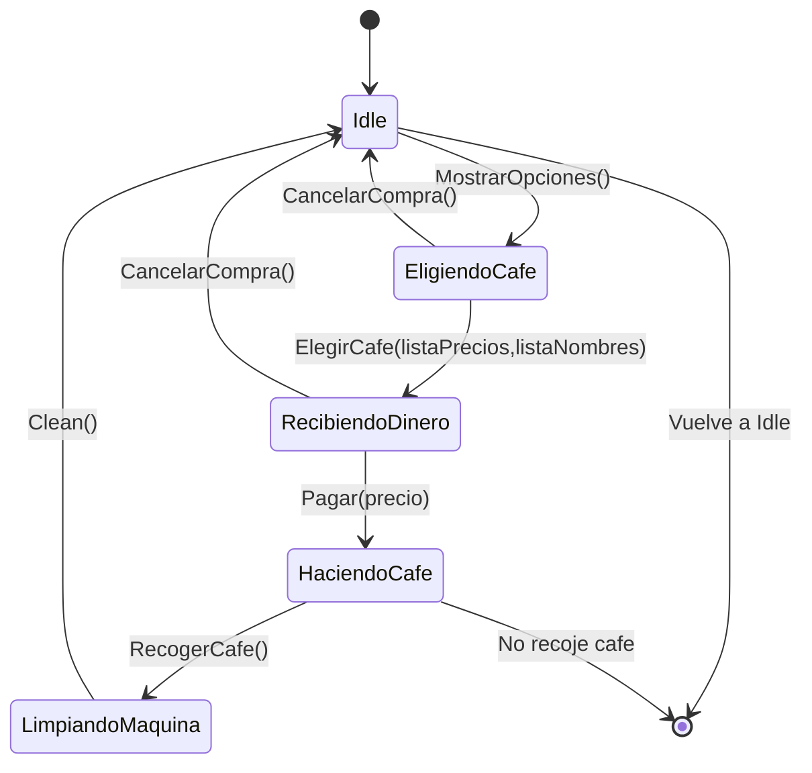

# Máquina cafe

## Diagrama

Este diagrama es una representación del estado actual del código.
Idealmente `HaciendoCafe` no terminaria el programa, pero
si no se hace asi entoces entraria en bucle hasta que recojas el cafe y no quiero un bucle infinito.