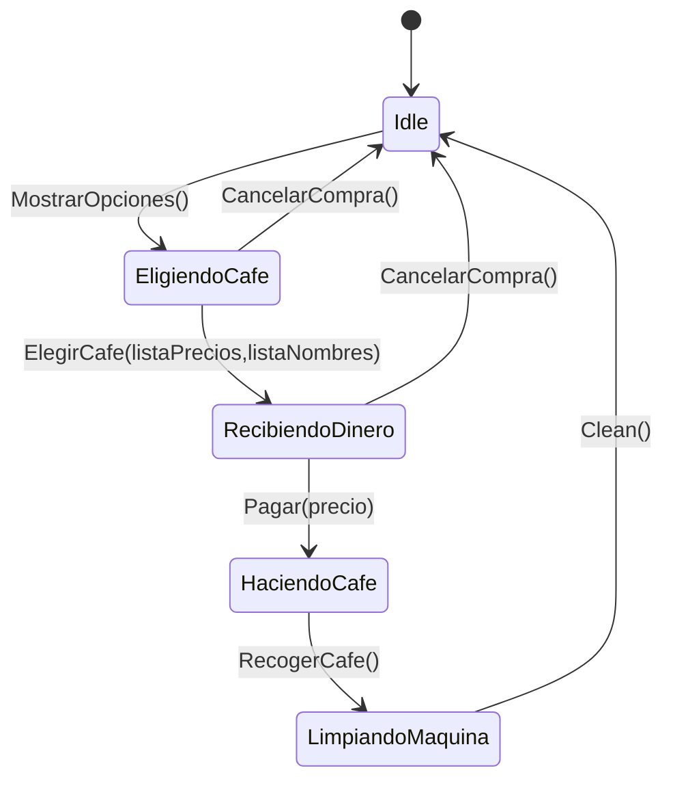

# Máquina cafe

## Diagrama

```mermaid
stateDiagram-v2
    [*] --> Idle
    Idle --> EligiendoCafe: MostrarOpciones()
    EligiendoCafe --> Idle: CancelarCompra()
    EligiendoCafe --> RecibiendoDinero:ElegirCafe(listaPrecios,listaNombres)
    RecibiendoDinero --> Idle: CancelarCompra()
    RecibiendoDinero --> HaciendoCafe: Pagar(precio)
    HaciendoCafe --> LimpiandoMaquina: RecogerCafe()
    LimpiandoMaquina --> Idle:Clean()
```